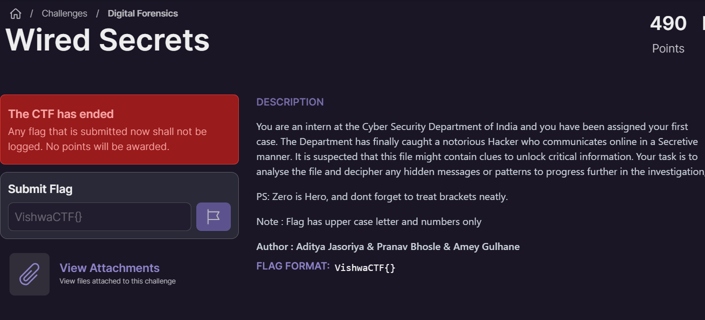
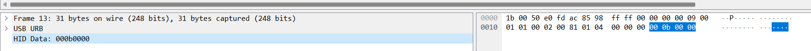
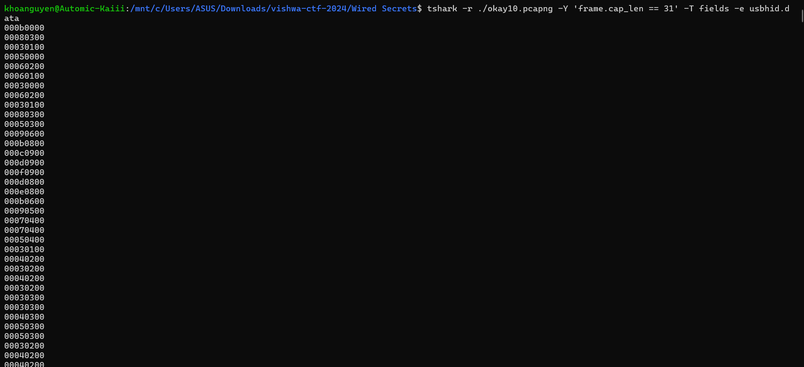
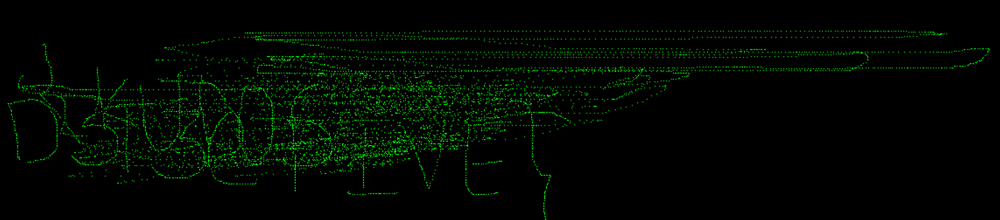

## Wired Secrets 

### Des : 

 

### Sol : 

+ Bài này liên quan đến usb mouse : 



+ Mình dùng tshark extract lấy data của nó ra :  

`$ tshark -r ./okay10.pcapng -Y 'frame.cap_len == 31' -T fields -e usbhid.data`



+ Đến đây thì viết code để vẽ tọa độ (x,y) của nó 

* Ví dụ : `000b0000` || `SS:XX:YY:00` => s là trạng thái, x là tọa độ x, y là tọa độ y.

+ Dựa vào đấy để vẽ hình @@, nhưng dùng lệnh `seb` để chỉnh format nó lại (SS:XX:YY:00) : 

`$ tshark -r ./okay10.pcapng -Y 'frame.cap_len == 31' -T fields -e usbhid.data | sed 's/../:&/g2' > test.txt`

```
from PIL import Image
import ctypes

width = 2048
height = 2048
img = Image.new("RGB", (width, height))

red = (0, 0, 0) # Skipping Right Mouse Btn, its not needed at all
green = (0, 255, 0)
blue = (0, 0, 0)
default = (0, 0, 0)

colormap = {
    0: red,
    1: green,
    2: blue
}
x = width//2
y = height//2

with open('test.txt') as f:
    for line in f:
        bytes = map(lambda v: int('0x'+v, 16), line.split(":"))
        b0, b1, b2, b3 = bytes

        # byte0: 0==LBM, 1=RBM, 2=MBM
        color = colormap.get(b0, default)

        # byte1: X displacement
        x_dis  = ctypes.c_int8(b1).value

        # byte2: Y displacement
        y_dis = ctypes.c_int8(b2).value

        x = x + x_dis
        y = y + y_dis

        #print "line = ", line, "bytes =", bytes, x, y

        img.putpixel((x, y), color)

img.save("image.png")
```

+ Sau khi vẽ xong thì hình hơi xấu nên nhìn ra flag thì cũng khó @@. 



### FLAG : `VishwaCTF{KUD0SD3T3CTIVE}`